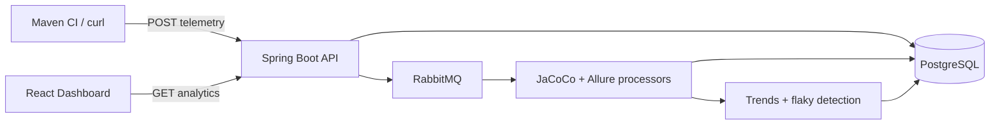

<div align="center">

# QualityWatch

**See test coverage, flaky tests, and build health — all in one place.**

Tracks quality signals from your Java CI pipelines and turns them into a live engineering dashboard.

<br />

[](https://openjdk.org/)
[](https://spring.io/projects/spring-boot)
[](https://react.dev/)
[](https://www.postgresql.org/)
[](https://www.rabbitmq.com/)
[](https://www.docker.com/)

<br />


</div>

---

## The problem

Java teams run tests in CI every day, but quality data is scattered:

- JaCoCo coverage lives in build artifacts
- Allure / test results sit in reports nobody revisits
- Flaky tests are hard to track across builds
- There is no single view of **“is this project getting healthier?”**

## The solution

**QualityWatch** is a full-stack observability platform that:

1. **Collects** JaCoCo + Allure telemetry from CI (Maven plugin or REST API)
2. **Processes** it asynchronously through RabbitMQ into PostgreSQL
3. **Surfaces** trends, flaky tests, and build health in a React dashboard

Built for portfolio demos, resume projects, and teams who want a lightweight quality command center.

---

## What you get

<table>
<tr>
<td width="50%" valign="top">

### Dashboard at a glance
- Latest **line & branch coverage** KPIs
- **Coverage trend** charts over time
- **Flaky test** detection with failure rates
- **Build health** timeline (pass/fail, test counts)

</td>
<td width="50%" valign="top">

### Built for real pipelines
- **Maven plugin** uploads on `mvn verify`
- **Non-blocking** — CI never fails if QualityWatch is down
- **API key** auth for uploads, **HTTP Basic** for dashboard reads
- **Idempotent** processing + retry/DLQ for reliability

</td>
</tr>
</table>

### Dashboard pages

| Page | What it shows |
|------|---------------|
| `/dashboard` | Overview — coverage KPIs, trend chart, flaky tests, recent builds |
| `/coverage` | Deep dive into line/branch coverage trends by branch |
| `/tests` | Flaky tests ranked by failure rate and confidence |
| `/builds` | Build history with total/failed test counts per run |

---

## How it works



| Step | What happens |
|------|--------------|
| **1. Ingest** | CI sends JSON payload → event stored → message queued |
| **2. Process** | Consumer parses JaCoCo/Allure → normalized tables |
| **3. Aggregate** | Materialized views refreshed, flaky tests recomputed |
| **4. Visualize** | Dashboard pulls `/api/v1/analytics/*` endpoints |

---

## Project structure

```
quality-watch/
├── qualitywatch-backend/    # Spring Boot API, Flyway migrations, RabbitMQ workers
├── qualitywatch-frontend/   # React + Vite + Tailwind + Recharts dashboard
├── qualitywatch-agent/      # Maven plugin (JaCoCo + Allure collectors)
├── docker/                  # Local & production Docker Compose
├── scripts/                 # Demo seed + deploy helpers
├── render.yaml              # One-click Render Blueprint
└── docs/                    # Render & Railway deploy guides
```

---

## Quick start

### Docker — full stack in 2 commands

**Requires:** [Docker Desktop](https://www.docker.com/products/docker-desktop/)

```bash
cd docker
cp .env.example .env
docker compose -f docker-compose.prod.yml --env-file .env up --build -d
```

| Service | URL |
|---------|-----|
| Dashboard | http://localhost:3000 |
| API | http://localhost:8080 |

Seed demo data and open the dashboard:

```bash
export QUALITYWATCH_API_KEY=local-upload-key
./scripts/seed-demo-telemetry.sh http://localhost:8080
```

→ Open **http://localhost:3000** → select **`demo-service`**

<details>
<summary><strong>Dev mode</strong> — run backend & frontend separately</summary>

```bash
# Infrastructure
cd docker && docker compose up -d postgres rabbitmq

# Backend (port 8080)
cd qualitywatch-backend && mvn spring-boot:run

# Frontend (port 5173)
cd qualitywatch-frontend && npm install && npm run dev
```

Swagger UI (dev only): http://localhost:8080/swagger-ui.html

</details>

---

## CI integration

Install the Maven agent, then add to your project's `pom.xml`:

```bash
cd qualitywatch-agent && mvn install
```

```xml
<plugin>
  <groupId>com.qualitywatch</groupId>
  <artifactId>qualitywatch-agent</artifactId>
  <version>1.0.0-SNAPSHOT</version>
  <configuration>
    <serverUrl>https://YOUR-BACKEND-URL</serverUrl>
    <projectName>my-service</projectName>
    <apiKey>${env.QUALITYWATCH_API_KEY}</apiKey>
  </configuration>
  <executions>
    <execution>
      <goals><goal>upload</goal></goals>
    </execution>
  </executions>
</plugin>
```

Runs automatically on `mvn verify`. Collects JaCoCo coverage + Allure test results and uploads to QualityWatch.

<details>
<summary><strong>Manual upload via curl</strong></summary>

```bash
curl -X POST http://localhost:8080/api/v1/telemetry/upload \
  -H "Content-Type: application/json" \
  -H "X-API-Key: ${QUALITYWATCH_API_KEY}" \
  -d '{
    "projectName": "my-service",
    "buildNumber": "42",
    "branch": "main",
    "commitHash": "deadbeef",
    "timestamp": 1715000000000,
    "coverage": {
      "lineCoveragePercent": 80.0,
      "branchCoveragePercent": 70.0,
      "linesCovered": 800,
      "linesTotal": 1000
    },
    "testExecution": {
      "tests": [{
        "suiteName": "unit",
        "className": "com.example.MyTest",
        "methodName": "shouldWork",
        "status": "PASSED",
        "durationMs": 100
      }]
    }
  }'
```

</details>

---

## Deploy

Ship a public HTTPS demo for your resume:

| Platform | Guide | Best for |
|----------|-------|----------|
| **Render** | [docs/DEPLOY-RENDER.md](docs/DEPLOY-RENDER.md) | Free tier, Blueprint deploy |
| **Railway** | [docs/DEPLOY-RAILWAY.md](docs/DEPLOY-RAILWAY.md) | All-in-one Docker services |

**Render checklist:**
1. Connect GitHub repo → **New Blueprint** → uses [`render.yaml`](render.yaml)
2. Add [CloudAMQP](https://www.cloudamqp.com/) RabbitMQ credentials
3. Set Postgres JDBC URL as `jdbc:postgresql://HOST:5432/DB` (credentials in separate env vars)
4. Seed demo data → update live URLs in this README

Env reference: [`docker/.env.example`](docker/.env.example)

---

## Tech stack

| Layer | Technologies |
|-------|-------------|
| **Backend** | Java 21, Spring Boot 3, Spring Data JPA, Flyway, Spring Security |
| **Messaging** | RabbitMQ (retry, dead-letter queue, aggregation consumer) |
| **Database** | PostgreSQL 16, materialized views for coverage trends |
| **Frontend** | React 19, TypeScript, Vite, Tailwind CSS, Recharts, TanStack Query |
| **Agent** | Maven plugin, JaCoCo + Allure collectors |
| **Ops** | Docker Compose, Render/Railway, GitHub Actions CI, Testcontainers |

---

## Testing & CI

```bash
mvn verify   # unit + integration tests (Testcontainers when Docker is available)
```

Every push runs the full build pipeline via [`.github/workflows/ci.yml`](.github/workflows/ci.yml) — backend tests, frontend build, and lint.

---

<div align="center">

**Built by [Risheek Shukla](https://github.com/RisheekShukla)**

If this project helped you, consider giving it a star.

</div>
